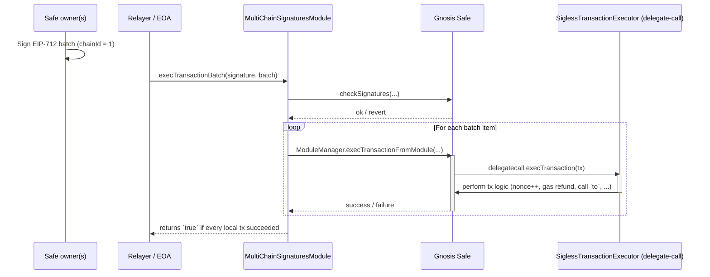

# Safe Multi-Chain Signatures Module

This is a module for the Safe smart account that allows for multi-chain signatures.

### How to deploy

```bash
forge script script/SiglessTransactionExecutor.s.sol:SiglessTransactionExecutorScript --rpc-url $RPC_URL --broadcast --verify -vvvv
forge script script/MultiChainSignaturesModule.s.sol:MultiChainSignaturesModuleScript --rpc-url $RPC_URL --broadcast --verify -vvvv
```

The scripts use [CREATEX](https://github.com/pcaversaccio/createx) (specifically [radeksvarz's createx-forge library](https://github.com/radeksvarz/createx-forge)) to deploy the contracts on any chain deterministically. Deploying v0.0 release of these contracts, you should get the following addresses:
- SiglessTransactionExecutor: `0xFE8E3275aDeb5bB326ded58d1336aDb2b7A68f4b`
- MultiChainSignaturesModule: `0xc254C43E27FB03791663C109A4DFD0EB99242Ee9`

## How it works

### Contracts
- [**ISafeTx**](./src/common/ISafeTx.sol) — Tiny library that defines the `SafeTx` struct so every contract agrees on its layout.
- [**SiglessTransactionExecutor**](./src/libraries/SiglessTransactionExecutor.sol) — Contains a stripped-down version of `Safe.execTransaction` that _omits_ signature verification. Must be called with `delegatecall` so it operates directly on the Safe's storage.
- [**MultiChainSignaturesModule**](./src/modules/MultiChainSignaturesModule.sol) — A Safe module that (a) verifies a batched signature, (b) filters by `chainId`, and (c) forwards each relevant `SafeTx` to `SiglessTransactionExecutor`.

### High-level overview
1. Owners sign **one EIP-712 message** (using chainId = 1) that bundles _N_ transactions plus the chainId each transaction is intended for.
2. Anyone sends that signature to the module on a particular network (Ethereum, Optimism, Arbitrum, …).
3. The module verifies the signature **once**, then iterates through the batch:
   * If `chainIds[i] == block.chainid` the transaction is executed.
   * Execution happens via **delegate-calling** into `SiglessTransactionExecutor`, re-using Safe's core logic but skipping signature checks (they were already done in step 2).

### Visualization



### Why the chainId hack works

EIP-712 intends the `chainId` in the domain separator to stop replay across chains.  By _hard-coding_ `chainId = 1` inside the module's domain separator we **intentionally** permit the same signature to be reused.  Replay risk is mitigated by the extra `chainIds[]` array that marks which chain each transaction is _supposed_ to run on; mismatches are simply skipped.

### Gas & security notes
* **Single sig-check → many executions** – signature recovery costs ~3 k gas per signer; we pay it once instead of _n_ times.
* `SiglessTransactionExecutor` still checks and increments the Safe `nonce`, so each `SafeTx` is non-replayable per chain.
* Guard logic is currently **disabled**.

## Installation

```bash
forge install ultrasoundlabs/safe-multichain-signatures
forge build
forge test -vvv
```

### Quick usage example

1. Owners craft a JSON describing their batch:

```json
{
  "safeTxs": [
    {
      "to": "0xAbC…",
      "value": "0",
      "data": "0x…",
      "operation": 0,
      "safeTxGas": 100000,
      "baseGas": 0,
      "gasPrice": 0,
      "gasToken": "0x0",
      "refundReceiver": "0x0",
      "nonce": 42
    }
  ],
  "chainIds": [1]
}
```

2. Hash & sign it with any EIP-712-capable wallet (MetaMask, Safe Sign Message, …).
3. Call `execTransactionBatch` on the module contract, passing:
   * `account` – the Safe address,
   * the struct above,
   * the collected signature bytes.

If the signature is valid and the Safe has modules enabled, the transaction executes.

## Further reading
* [Safe docs](https://docs.safe.global/) – deep dive into accounts, modules, guards.
* [EIP-712](https://eips.ethereum.org/EIPS/eip-712) – structured off-chain signing.

## License

We inherit the license of the Safe contracts, which is GPL-3.0. For more information, see [LICENSE](./LICENSE).

## Security

The module is not audited yet, so you should not use it in production.

For security-related issues, please contact us at [security@ultrasoundlabs.org](mailto:security@ultrasoundlabs.org).